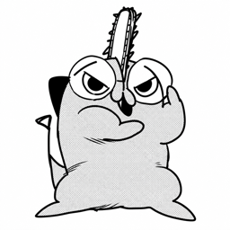
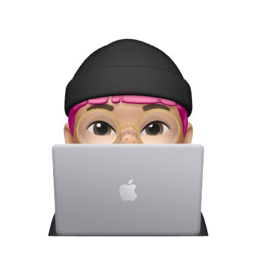

# Woolpixels

**Things I made because I wanted to use them.**
做小而用心的 App —— 因为自己想用，所以做出来。

[App Store 应用](#-app-store-上架应用) · [桌面工具](#-对外分发的桌面工具) · [更多作品](#-更多作品) · [联系我](#-联系)

---

## 👋 关于

Hi，我是 Woolpixels，一名独立开发者。

我相信好工具不必喧哗，只需安静地把一件事做好。这里的每个产品都从我自己的真实需求出发：追剧、读书、听歌、整理文件、做设计……做出来先自己用，用顺手了再分享给你。

**我做产品的几条原则**

- 🧶 **小而专注**：一个工具只解决一件事，并把它做好
- 🔒 **本地优先**：数据留在你的设备上，文件全程本地处理，不上传
- 🌿 **不打扰**：不抓取、不强行社交、没有多余的提醒
- ☁️ **按需同步**：iOS 应用支持 iCloud 同步，由你决定

---

## 📱 App Store 上架应用

iOS 应用，可直接在 App Store 下载。

| | 应用 | 简介 |
| :-: | :-- | :-- |
|  | **[追追追 · Odyssey](https://apps.apple.com/cn/app/%E8%BF%BD%E8%BF%BD%E8%BF%BD/id6772548326)** | 把每一部追过的剧，都收进自己的海报墙。海报墙、片刻、「我超爱」、追剧日历，支持 iCloud 同步。 |
|  | **[便历 · GutLog](https://apps.apple.com/cn/app/%E4%BE%BF%E5%8E%86-%E6%8E%92%E4%BE%BF%E8%AE%B0%E5%BD%95/id6786214588)** | 轻量记录每日排便，用日历看见自己的规律。计时记录、月历、统计分析，数据本地保存，iOS 17+。仅作个人记录，不提供医学诊断。 |

---

## 🖥 对外分发的桌面工具

全程本地处理，不上传文件。

| | 工具 | 简介 | 平台 |
| :-: | :-- | :-- | :-- |
|  | **[Maki 巻纂](https://github.com/woolpixels/Maki-releases)** | 漫画 PDF 装订工具。自动排序、分册，生成带封面与可点击目录的单行本。 | macOS · Windows |
|  | **[Kusuri 薬](https://github.com/woolpixels/Kusuri-releases)** | Kindle 无线图书与文件管理。同一 Wi-Fi 下上传、整理、预览，不经过云端。 | macOS · Apple Silicon |
|  | **[Nuki 抜き](https://github.com/woolpixels/Nuki-releases)** | 小说角色抽读与重组成书。按角色或关键词抽出章节，重组为新的 EPUB / TXT。 | macOS · Apple Silicon |
|  | **[一起唱 · SingAlong](https://github.com/woolpixels/SingAlong-releases)** | macOS 悬浮歌词。自动识别 Apple Music / Spotify 正在播放的歌曲，同步歌词逐行滚动。 | macOS 13+ |
|  | **[Otoji](https://github.com/woolpixels/Otoji)** | 本地视频转 MP3、裁切与音频拼接。只专注「提取」和「拼接」，断网也能用。 | macOS · Apple Silicon |

> 下载请前往各项目的 **Releases** 页面获取最新版本。

---

## 🧪 更多作品

自用为主的小工具，持续打磨中。

| | 作品 | 简介 | 平台 |
| :-: | :-- | :-- | :-- |
|  | **Hagi 剥ぎ** | Figma 插件，一键将画框生成可编辑、视觉还原的分层 PSD，可打包 PSD、PNG 与字体清单。 | 桌面 |
|  | **PasteDeck 粘粘又贴贴** | 本地 Logo 素材管理与排版工具，快速匹配 Logo，支持 SVG / PNG 复制与打包导出。 | 桌面 |
|  | **PilePilePile 堆堆堆** | 文字构图工具。输入词条，自动排布成图形或图片遮罩，导出 PNG / SVG。 | Web · macOS |
|  | **Tsundoku 积読** | 本地优先的图书管理与听书工具：看书、听书、书摘与阅读进度。 | Web · macOS |
|  | **Workday 阿忙的一天** | 本地优先的 macOS 个人节律小工具：任务、计时、提醒、复盘与 Notion 同步。 | macOS |

---

## 📬 联系

- 🌐 GitHub：[github.com/woolpixels](https://github.com/woolpixels)
- 📕 小红书：[Woolpixels](https://xhslink.cn/o/7EEkbW1Uyh8)
- ✉️ 邮箱：[odyssey.moment@outlook.com](mailto:odyssey.moment@outlook.com)

遇到问题或有想法，欢迎在对应项目的 Issues 里留言，或通过以上方式找到我。

Made with 🧶 by Woolpixels · 小而用心，持续打磨

